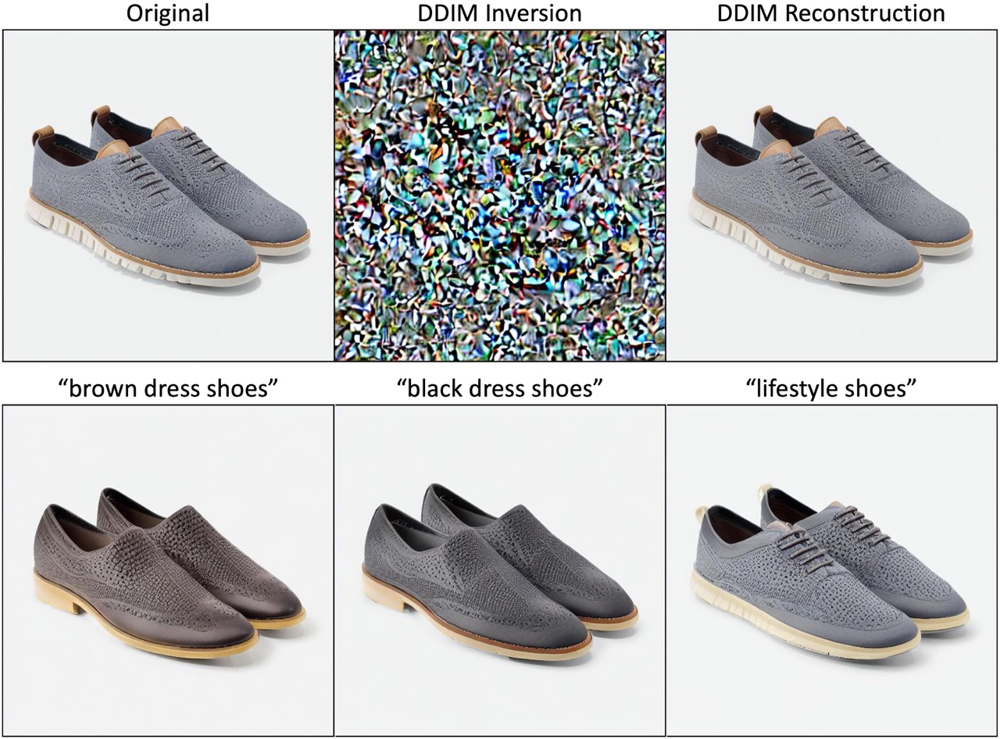

# Stable Diffusion

This fork implements various recent papers based on Stable Diffusion.

## Direct Inversion: Optimization-Free Text-Driven Real Image Editing with Diffusion Models
[[Paper]](https://arxiv.org/abs/2211.07825)


To run DDIM inversion:
```
python scripts/stable_direct_inversion.py --ddim_eta 0.0 --n_samples 1 --n_iter 1 --ddim_steps_inv 100 --ddim_steps 100 --ckpt <path/to/stablediffusion/ckpt> --outdir outputs --ref_img_path "assets/shoes.jpg" --scale_inv 1 --scale 1 --prompt_inv "grey shoes" --prompt "grey shoes" --ddim_eta 0
```

To run direct inversion editing:
```
python scripts/stable_direct_inversion.py --ddim_eta 0.0 --n_samples 1 --n_iter 1 --ddim_steps_inv 100 --ddim_steps 100 --ckpt <path/to/stablediffusion/ckpt> --outdir outputs --ref_img_path "assets/shoes.jpg" --scale_inv 1 --scale 1 --prompt_inv "grey shoes" --prompt "brown dress shoes" --ddim_eta 0.25
```

# TODO
- [x] [Direct Inversion](https://arxiv.org/abs/2211.07825)
- [x] Model-based CFG
- [ ] [Null-Text Inversion](http://arxiv.org/abs/2211.09794)
